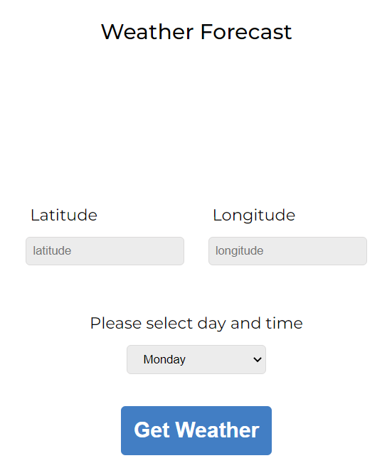

# WeatherForecastApplication

The purpose of Weather Forecast Application is to fetch the details of the weather on a particular day or in near future of a location as per the latitude and longitude provided by the user as its input.

Note: This application works only for latitude and longitude of places in United States.

## Application UI:

## How to use it:
