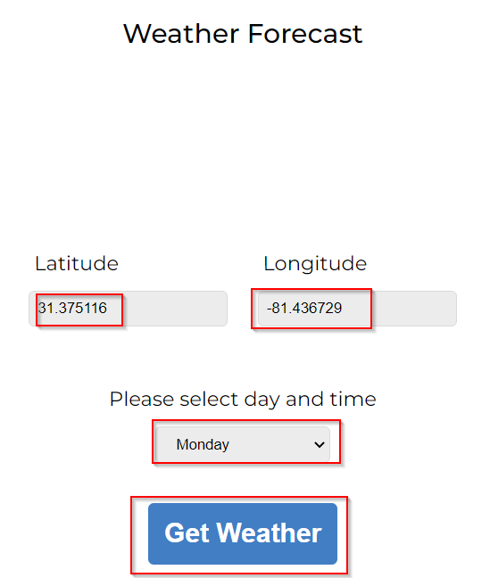

# WeatherForecastApplication

The purpose of Weather Forecast Application is to fetch the details of the weather on a particular day or in near future of a location as per the latitude and longitude provided by the user as its input.

**Note**: This application works only for latitude and longitude of places in United States.

## Application UI:

## How to use it:

- Compile and run the [index.html](./src/index.html)

  

- Provide **latitude** and **longitude** in the input fields, select **day and time** from the drop down menu and click on the **Get Weather** button

  

### Output:

## How the application was built:

#### Langages Used:

- HTML, CSS
- JavaScript

**API Service** used: [National Weather Service (NWS)](https://www.weather.gov/documentation/services-web-api&sa=D&source=calendar&ust=1641768438693965&usg=AOvVaw3OWCV8Z2DjkIpuF6eXz_L2)

### Code Review:

- [index.html](./src/index.html) : Contains the HTML code for the UI of Weather Forecast Application

  

- [style.css](./src/style.css) : Contains the definitions for styling of the layout, elements, etc used in the [index.html](./index.html)

  

- [weather.js](./src/weather.js) : Contains the JavaScript code for the logic used to fetch Weather Forecast data for this application

  - Function to call the API, retrieve and store the JSON from the API response and extract the data.

    

  - Function to display weather data for a particular input, data and time.

    

  - Function to handle the errors in wrong input formats or input values.

    

# THANK YOU!
